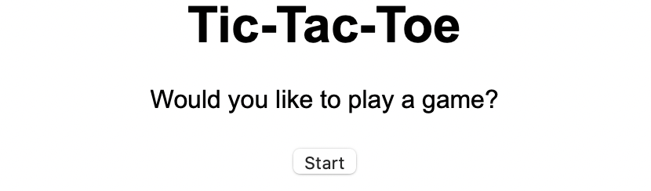
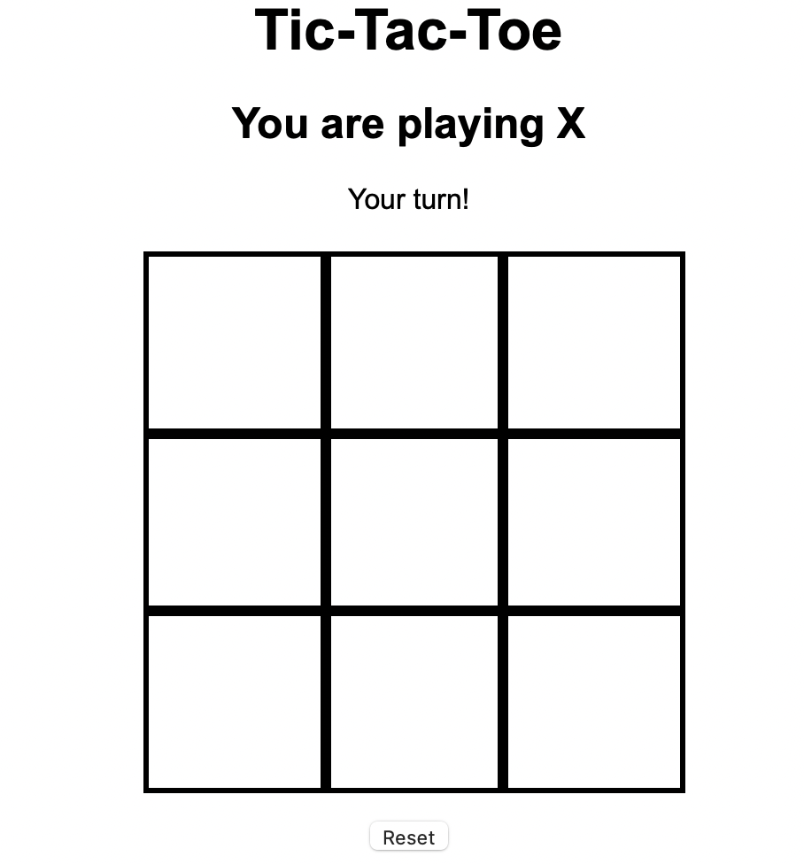
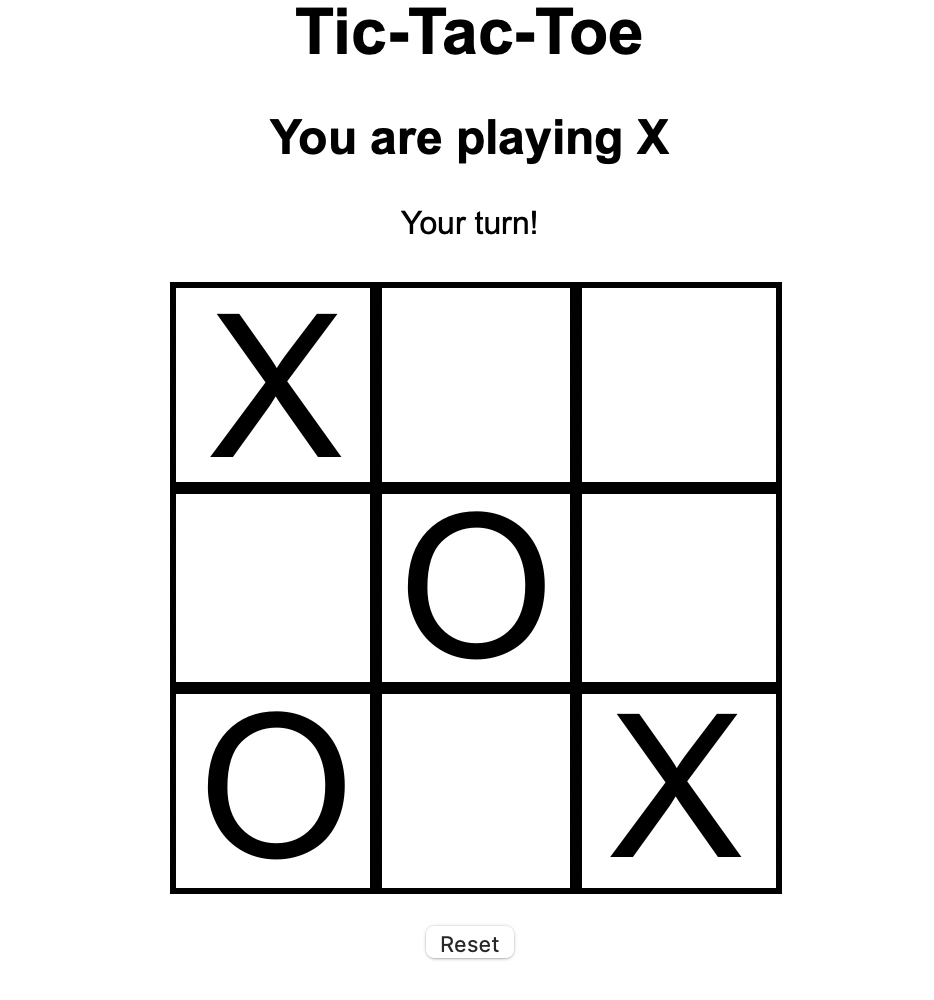
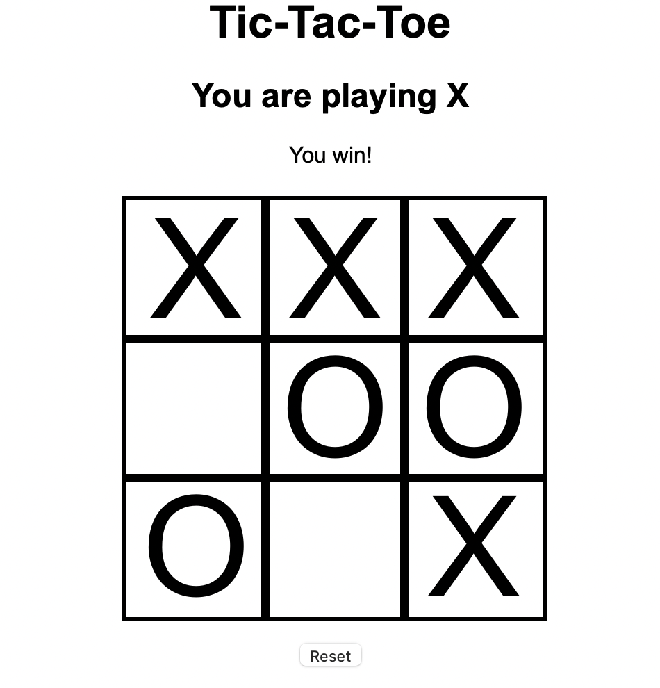

# Tic-Tac-Toe

*Allows players the option of playing X or O and facing off against an AI*

**Contents**

1. [Description](#description)
2. [Features](#features)
3. [Installation](#installation)
4. [Views](#views)
5. [Code Examples](#code-examples)
6. [Testing](#testing)
7. [Future Goals](#future-goals)

## Description

This is a **TypeScript** web app built without using a framework. It uses **Parcel** for compilation purposes. It is a part of a series of apps designed to compare various approaches to building a Tic-Tac-Toe game. Check out the code base for the [vanilla JavaScript](https://github.com/jtreeves/tic-tac-toe-javascript) version of the same app. Play a [live version](https://tic-tac-toe-typescript-comparison.netlify.app) of the game.

## Features

- Play against an AI
- Choose to play X or O
- See updates to the screen about whether it's your turn, whether you or the computer has won, or whether it's resulted in a tie game
- Choose to play again or abandon a game with a single button

## Installation

### Create Local Repository

1. Fork and clone this repository to your local computer
2. Run `npm i` to install all necessary dependencies

### Run App Locally

1. Run `npm run serve` within your local directory
2. View the live version of the site at `http://localhost:1234`

## Views

**Landing Screen**



**Options Screen**


**Empty Board**



**Game in Progress**



**Win Screen**



## Code Examples

**Convert state from localStorage into an array of numbers**

```ts
function getPoints(): number[] {
    const singleString: string = getValue('points')
    const arrayOfStrings: string[] = singleString.split(',')
    const arrayOfNumbers: number[] = arrayOfStrings.map((
        item: string
    ): number => {
        const numberValue: number = Number(item)
        
        return numberValue
    })

    return arrayOfNumbers
}
```

**Generate DOM element with inner elements containing unique ids**

```ts
function createBoard(): HTMLElement {
    const section: HTMLElement = document.createElement('section')
    const points: number[] = getPoints()

    points.forEach((
        _: number, 
        index: number
    ): void => {
        const id: string = 'square-' + index
        const cell: HTMLElement = createCell(id)

        section.appendChild(cell)
    })

    return section
}
```

**Choose a cell on the screen that has not yet been used**

```ts
function selectRandomEmptyCell(): HTMLElement {
    const cells: NodeListOf<HTMLElement> = document.querySelectorAll('article')
    const emptyCells: HTMLElement[] = []
    
    cells.forEach((
        cell: HTMLElement
    ): void => {
        if (cell.textContent === '') {
            emptyCells.push(cell)
        }
    })

    const amount: number = emptyCells.length
    const randomIndex: number = Math.floor(Math.random() * amount)
    const randomCell: HTMLElement = emptyCells[randomIndex]

    return randomCell
}
```

## Testing

This repository uses **Jest** for testing. It should be one of the dev dependencies initially installed.

- The app features 111 passing tests
- To check them, run `npm run test`

## Future Goals

- Styling
- More test cases
